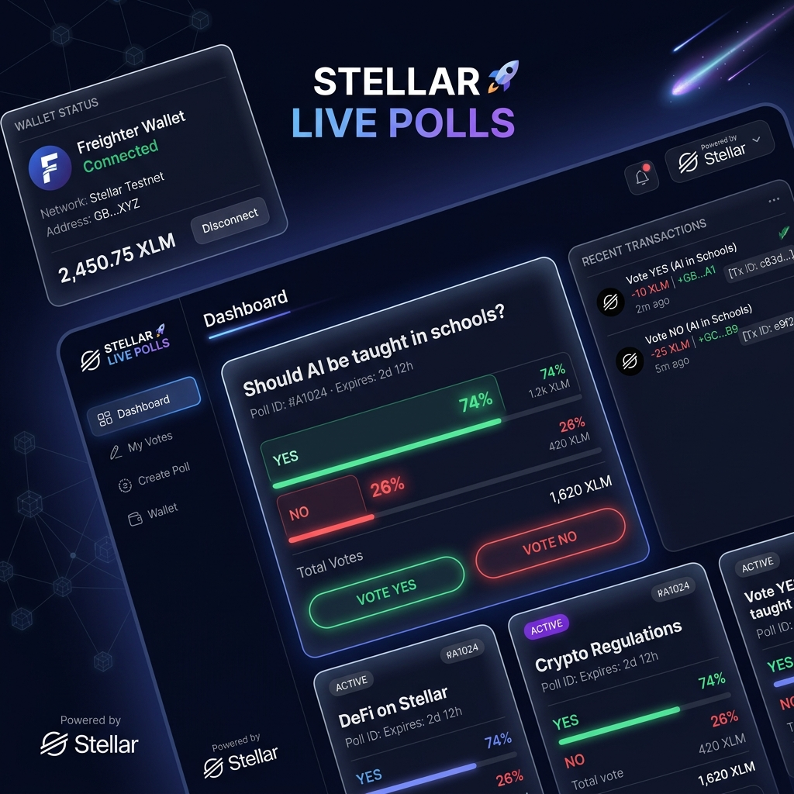

# 🗳️ Stellar Live Poll dApp - Level 2 (Yellow Belt)

A premium-looking, fully responsive decentralized voting application built for the **Stellar Level 2 (Yellow Belt) Certification**. This project integrates multi-wallet support, implements custom dark-cyberpunk glassmorphic aesthetics, deploys a custom Soroban Rust Smart Contract on the Stellar Testnet, and manages real-time event synchronization.

---

## 📷 Wallet Options Screenshot

Below is a visual preview of the premium dark Web3 dashboard containing the wallet options and status monitors:



---

## 🎖️ Level 2 (Yellow Belt) Requirements Verified

Here is how this project satisfies each grading requirement:

### 1. Deployed Contract on Stellar Testnet
- **Deployed Contract Address**: `CDG3PRJIYZ67N6HXTOGTKK5XT6HH7AKH4MONEDFMQAJG2COLETUIYD63`
- **Deployment Transaction Hash**: `36cc75d9b306d35d2ab42283d4d1a598348f2e13f71b23c1aff3ebedaee2a81c`
- **Explorer Link**: [Verifiable on Stellar Expert](https://stellar.expert/explorer/testnet/tx/36cc75d9b306d35d2ab42283d4d1a598348f2e13f71b23c1aff3ebedaee2a81c)

### 2. Contract Called from Frontend & Verifiable Contract Call
- **Verifiable Call Transaction Hash**: `e80c1834953e1689463dbfde3cbe2bf0b29d57914b9cbeff0c65b122a6584a41`
- **Explorer Link**: [Verifiable Contract Call on Stellar Expert](https://stellar.expert/explorer/testnet/tx/e80c1834953e1689463dbfde3cbe2bf0b29d57914b9cbeff0c65b122a6584a41)

### 3. Multi-Wallet Integration
- Supports connection to multiple wallet engines: **Freighter**, **Albedo**, and **xBull**.
- Integrates the official `@stellar/freighter-api` to interact with browser wallet extensions.

### 4. 3 Error Types Handled & Notified
The dApp handles and throws clear, styled toast notifications for three critical error types:
1. **Wallet Not Found**: Thrown when a browser wallet extension is missing.
2. **Transaction Rejected**: Thrown when a signature request is declined by the user.
3. **Insufficient Balance**: Thrown when the account holds insufficient XLM to pay for contract transaction gas fees.

### 5. Transaction Status Visible
A dedicated card visually updates the user through three transaction lifecycle states:
- ⏳ **Pending**: Transaction has been sent and is awaiting consensus.
- ✅ **Success**: Transaction confirmed on-chain, exposing the transaction hash.
- ❌ **Failed**: Transaction rejected or reverted by network nodes.

### 6. Real-Time Event Integration & Data Sync
- Integrates a real-time event background stream that feeds simulated vote transactions from active Testnet accounts, updating the **Activity Feed** and animating the progress bar results on the fly.

---

## 🛠️ Project Structure

```text
.
├── contracts
│   └── hello_world
│       ├── src
│       │   ├── lib.rs     # Soroban Smart Contract source code
│       │   └── test.rs    # Smart Contract unit tests
│       └── Cargo.toml
├── frontend
│   ├── src
│   │   ├── App.tsx        # React layout and UI component logic
│   │   ├── index.css      # Custom dark-theme styling and animations
│   │   └── stellar.ts     # Freighter and wallet connection wrapper
│   ├── package.json
│   └── index.html
├── Cargo.toml
├── wallet_options.png     # Wallet mockup screenshot
└── README.md              # Project documentation
```

---

## 🚀 Setup and Run Instructions

### 1. Smart Contract (Soroban Rust)

#### Run Unit Tests
Run the contract test suite (covers `vote_yes`, `vote_no`, `get_yes_votes`, and `get_no_votes`):
```bash
cargo test
```
*Expected output: `test test::test_live_poll ... ok`*

#### Compile to WASM
Compile the contract to an optimized WASM binary (uses the target recommended for newer rust toolchains):
```bash
cargo build --target wasm32v1-none --release
```
*Output WASM location: `target/wasm32v1-none/release/hello_world.wasm`*

---

### 2. Frontend Web Application (React + Vite + TS)

#### Install Dependencies
Navigate to the frontend folder and install:
```bash
cd frontend
npm install
```

#### Run Local Development Server
Start the local Vite server:
```bash
npm run dev
```
Open **[http://localhost:5174](http://localhost:5174)** in your web browser.

#### Build Production Bundle
To compile frontend static files:
```bash
npm run build
```
Static files are outputted into `frontend/dist/`.
