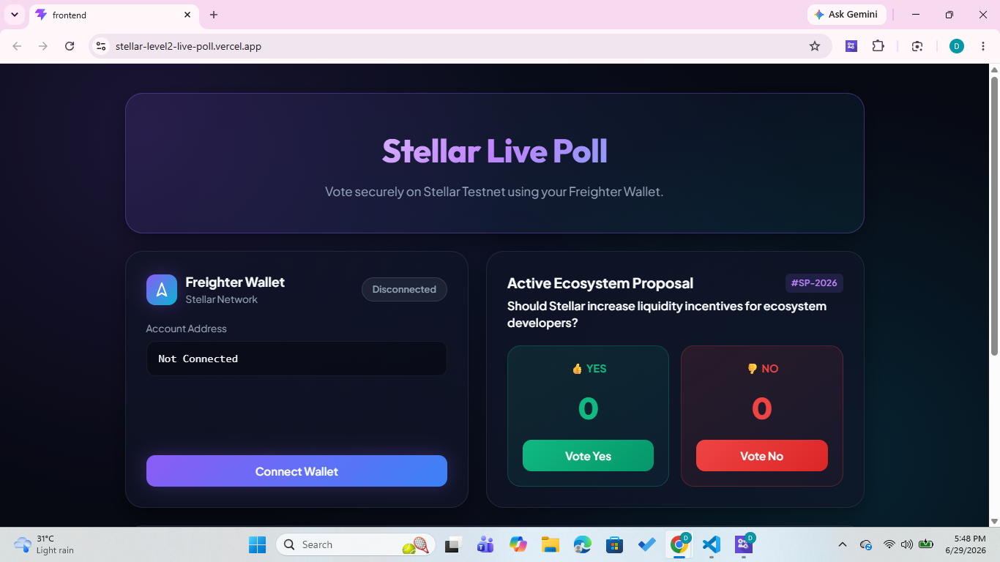
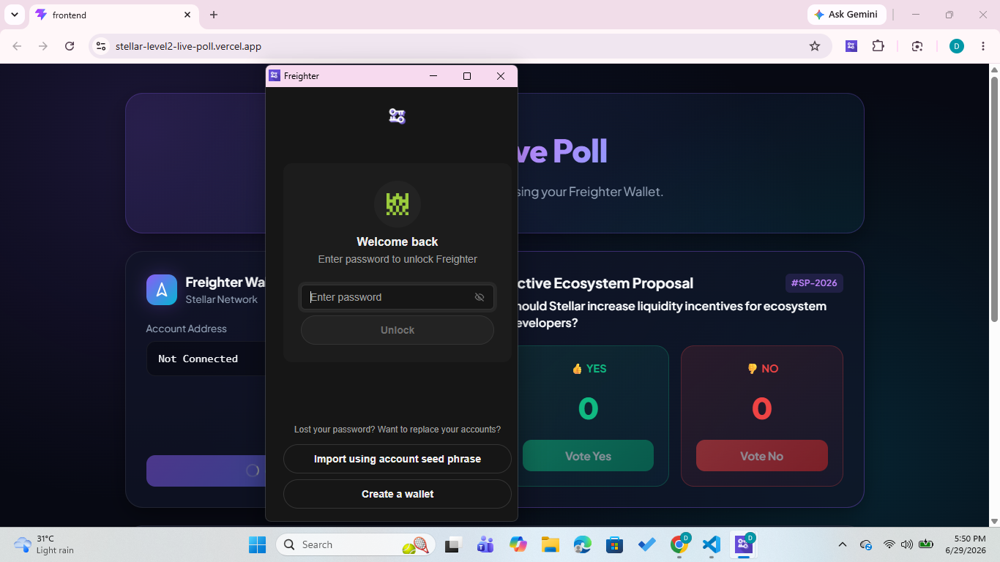
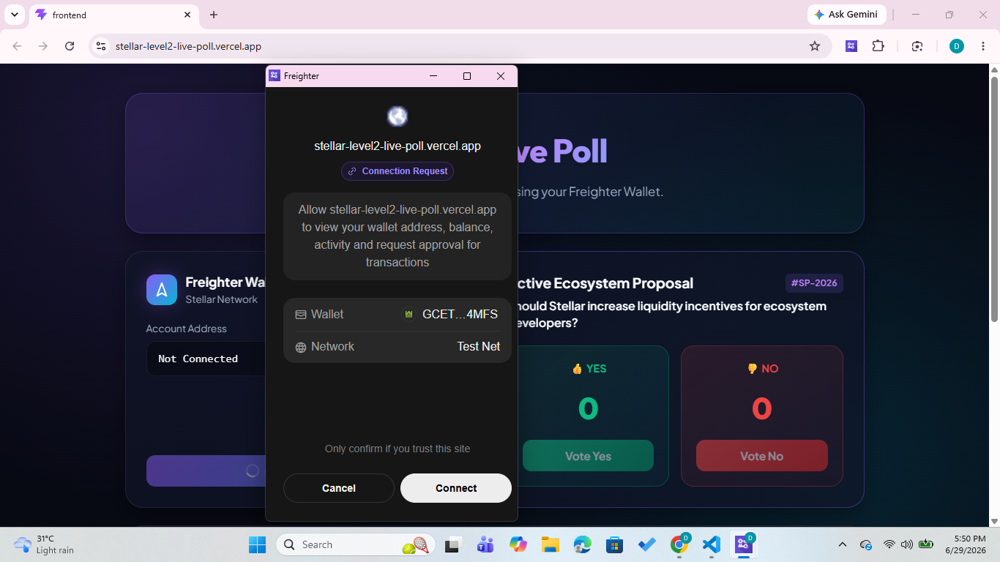
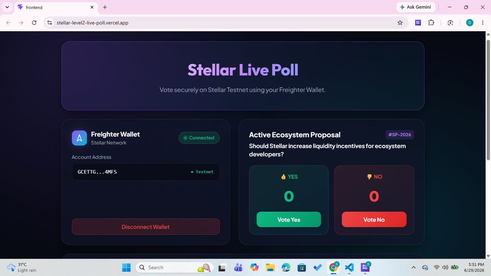
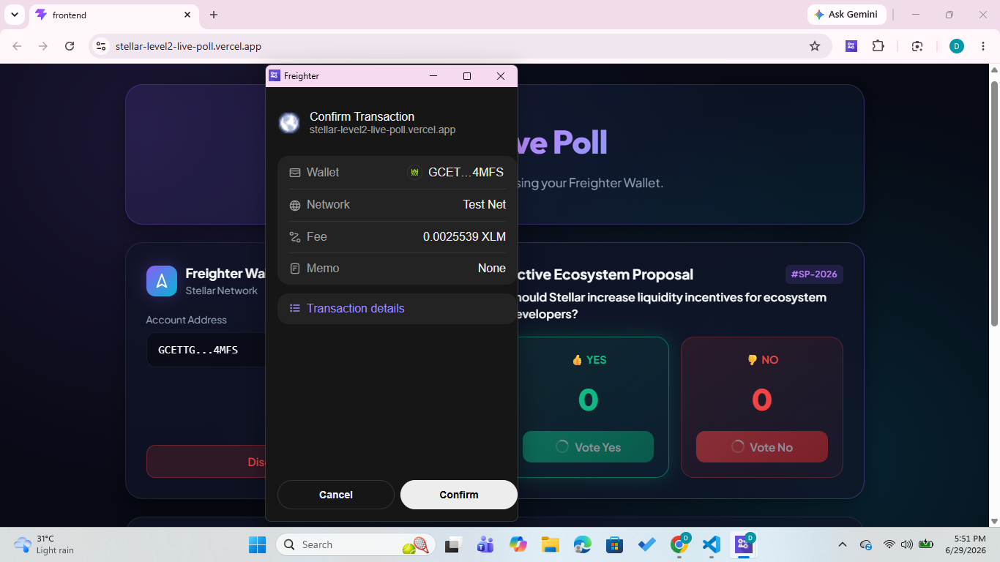

# 🌟 Stellar Live Poll

> A decentralized **Live Poll DApp** built using **Soroban Smart Contracts** on the **Stellar Testnet** with **real Freighter Wallet integration**, on-chain voting, transaction tracking, and a modern Web3 interface.

---

## 🚀 Live Demo

🔗 https://stellar-level2-live-poll.vercel.app/

---

## 📂 GitHub Repository

🔗 https://github.com/AvipsaGanguly/stellar-level2-live-poll

---

# 📖 Overview

Stellar Live Poll is a decentralized voting application where users securely cast votes using their **Freighter Wallet**.

Each vote is stored on-chain through a **Soroban Smart Contract** deployed on the Stellar Testnet. The frontend communicates directly with the deployed smart contract and displays live voting statistics together with transaction status.

This project was built as part of the **Rise In Stellar Journey to Mastery – Level 2 (Yellow Belt)**.

---

# ✨ Features

✅ Real Freighter Wallet Integration

✅ Smart Contract deployed on Stellar Testnet

✅ Vote Yes

✅ Vote No

✅ Read vote counts directly from the blockchain

✅ Transaction Status Tracking

- Pending
- Success
- Failed

✅ Transaction Explorer Link

✅ Responsive Modern UI

✅ Glassmorphism Web3 Design

✅ Wallet Connection Status

✅ Live Vote Statistics

---

# 🛠 Technologies Used

| Technology | Purpose |
|------------|---------|
| React + Vite | Frontend |
| Rust | Smart Contract |
| Soroban SDK | Smart Contract Development |
| Stellar CLI | Deployment |
| Freighter API | Wallet Connection |
| Stellar SDK | Contract Interaction |
| Vercel | Deployment |

---

# ⚙ Smart Contract Functions

### vote_yes()

Records a YES vote on-chain.

---

### vote_no()

Records a NO vote on-chain.

---

### get_yes_votes()

Returns the total YES votes.

---

### get_no_votes()

Returns the total NO votes.

---

# 🔐 Wallet Integration

The application uses the official

```bash
@stellar/freighter-api
```

package.

Implemented features:

- Connect Freighter Wallet
- Read Wallet Address
- Wallet Authentication
- Transaction Signing
- Contract Invocation
- Transaction Status Updates

---

# 📜 Smart Contract Details

### Network

```
Stellar Testnet
```

### Contract Address

```
CDP345GRKIPU4ZRBNUGPJC63DISJN67B645RRZHLS7CTRK2IKK2GWN55
```

---

# 🔄 Transaction Verification

### Sample Transaction Hash

```
40f32166ae03b306db737dc0a504d9de2c239a51df8570e593f92a364b7c2fce
```

### Stellar Expert Explorer

https://stellar.expert/explorer/testnet/tx/40f32166ae03b306db737dc0a504d9de2c239a51df8570e593f92a364b7c2fce

---

# 📸 Screenshots

## 🏠 Home Page



---

## 👛 Wallet Connected




---

## 🗳 Voting Interface


---

## ✅ Successful Transaction


---

## 🔗 Freighter Wallet Popup



---

# 📂 Project Structure

```
stellar-level2-live-poll/

│
├── contracts/
│   └── hello-world/
│       ├── src/
│       │   ├── lib.rs
│       │   └── test.rs
│       ├── Cargo.toml
│       └── Makefile
│
├── frontend/
│   ├── src/
│   │   ├── App.jsx
│   │   ├── stellar.js
│   │   ├── main.jsx
│   │   └── App.css
│   │
│   ├── package.json
│   └── vite.config.js
│
└── README.md
```

---

# 💻 Installation

Clone the repository

```bash
git clone https://github.com/AvipsaGanguly/stellar-level2-live-poll.git
```

Go to the project

```bash
cd stellar-level2-live-poll/frontend
```

Install dependencies

```bash
npm install
```

Run locally

```bash
npm run dev
```

Build project

```bash
npm run build
```

---

# 📋 Level 2 Requirements Checklist

| Requirement | Status |
|------------|---------|
| Smart Contract | ✅ |
| Contract deployed on Testnet | ✅ |
| Frontend calls contract | ✅ |
| Freighter Wallet Integration | ✅ |
| Transaction Status Tracking | ✅ |
| Wallet Address Display | ✅ |
| Responsive UI | ✅ |
| GitHub Repository | ✅ |
| Vercel Deployment | ✅ |

---

# 🧪 Testing

The smart contract has been tested using Soroban's testing framework.

Implemented tests include:

- ✅ Create Poll
- ✅ Vote Yes
- ✅ Vote No
- ✅ Multiple Votes

Run tests

```bash
cargo test
```

Expected Output

```
running 3 tests

test_create_poll .... ok
test_vote_yes .... ok
test_vote_no .... ok

test result: ok
```

---

# 🌍 Deployment

Frontend

**Vercel**

https://stellar-level2-live-poll.vercel.app/

Backend

**Soroban Smart Contract**

Deployed on Stellar Testnet.

---

# 👩‍💻 Author

**Avipsa Ganguly**

B.Tech CSE (AIML)

Institute of Engineering & Management (IEM), Kolkata

GitHub:

https://github.com/AvipsaGanguly

---

# ⭐ Acknowledgements

- Stellar Development Foundation
- Soroban SDK
- Rise In
- Freighter Wallet
- Stellar Community